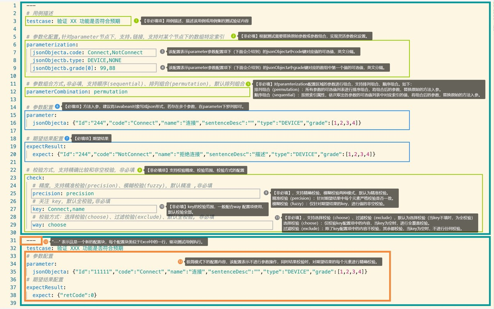
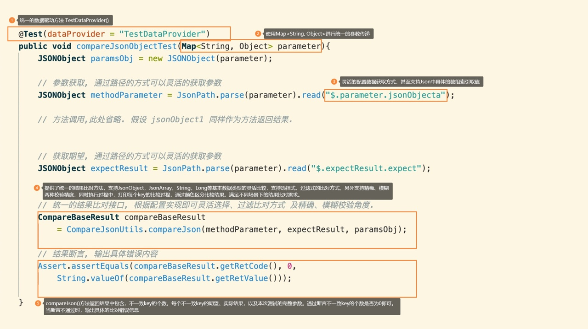
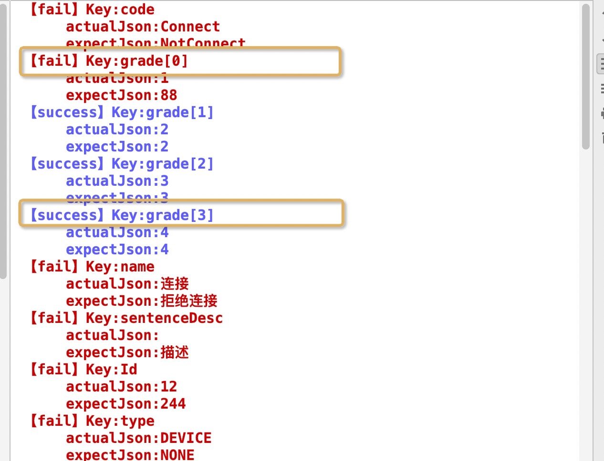

# wady（绿洲）接口自动化测试

## 1 简介


基于接口测试场景，一定程度解决以下几类问题：

- 测试数据与代码耦合程度较高，用例的可扩展性和可复用性较低。

- 测试覆盖度与测试用例维护成本之间的线性关系。

- 缺乏灵活统一的期望比对方式，存在较高的用例开发成本（重复度高）。


## 2 特性

**V1.0 新特性** 

- 数据驱动，基于Yaml 实现测试用例与测试数据的解耦。
- 参数化，支持指定参数项的参数化，实现参数的排列组合、顺序组合，为低维护成本下实现高覆盖提供可能，除了能够实现入参的参数化，也支持了对期望结果的参数设置。
- 提供统一且唯一的数据驱动方法，支持根据测试类、测试方法在指定目录下自动加载对应的配置文件。
- 提供统一的测试用例入参格式。
- 提供统一灵活的结果比对方法，支持JsonObject、JsonArray、String、Integer等基本数据类型的精确、模糊比较。

**V2.0 即将支持的特性**

- 接口测试用例自动生成，通过解析Jar文件，自动生成各接口的测试代码，实现对测试代码依赖解耦，将代码开发、维护成本降至到零。
- Yaml配置文件自动生成，根据接口方法入参，生成测试数据配置文件，实现驱动测试。


## 3 特性解析

### 3.1 数据配置

数据配置，一图抵千言，如下：




#### 3.1.1 数据驱动特性

##### YAML简介

YAML语言的设计参考了JSON，XML和SDL等语言。YAML 强调以数据为中心，简洁易读，编写简单，YAML基本格式要求，如下：

- 大小写敏感
- 通过缩进表示层级关系
- 禁止使用tab缩进，只能使用空格键
- 缩进的空格数目不重要，只要相同层级左对齐即可
- 使用#表示注释

##### YAML 多文档块特性

在对某些方法进行测试时，通常会使用不同的数据对方法进行覆盖，如边界值测试，YAML 多文档块（“---”）实现了在一个yaml中，隔离不同测试数据的目的。

```yaml
---
# 用例描述
testcase: 验证 XXX 功能是否符合预期
# 参数配置
parameter:
  jsonObjecta: {"Id":"1","code":"Connect","name":"连接","sentenceDesc":"","type":"DEVICE","grade":[1,2,3,4]}
# 期望配置
expectResult:
  expect: {"Id":"2","code":"Connect","name":"连接","sentenceDesc":"","type":"DEVICE","grade":[1,2,3,4]}

---
# 用例描述
testcase: 验证 XX 功能是否符合预期
# 参数配置
parameter:
  jsonObjecta: {"Id":"3","code":"Connect","name":"连接","sentenceDesc":"","type":"DEVICE","grade":[1,2,3,4]}
# 期望配置
expectResult:
  expect: {"Id":"3","code":"Connect","name":"连接","sentenceDesc":"","type":"DEVICE","grade":[1,2,3,4]}

```


#### 3.1.2 参数化特性

参数化是对数据驱动的进一步加强，帮助我们减少配置成本，如我们需要进行参数组合覆盖时，需要使用文档块逐一编写配置，重复性高，随着配置的不断增多，维护成本也剧增。参数化特性实现了参数灵活的排列组合和顺序排列。

##### 排列组合

```json
{"Id":"244","code":"Connect","sentenceDesc":{"desc":"","sentence":"你好"},"grade":[1,2,3,4]}
```

如，我们根据测试用例覆盖需要对以上参数中的sentence，grade中的第0个元素，进行不同参数组合的覆盖，通过在配置文件中添加parameterization配置项即可，如下

```yaml
---
testcase: 验证 XX 功能是否符合预期
# 参数化配置
parameterization:
  jsonObjectDemo.sentenceDesc.desc: 数据驱动, 参数化
  jsonObjectDemo.grade[0]: 99,88,77

# 参数组合方式,非必填，支持顺序和排列组合，默认排列组合
parameterCombination: permutation

# 参数配置
parameter:
  jsonObjectDemo: {"Id":"244","code":"Connect","sentenceDesc":{"desc":"","sentence":"你好"},"grade":[59, 33]}

# 期望配置
expectResult:
  expect: {……}
```

如上，当我们选择排列组合 (parameterCombination: **permutation**)时，数据配置可生成以下6种参数组合，并回填至原始参数中，如下。

```json
第1组 参数组合：
$.jsonObjectDemo.sentenceDesc.desc:数据驱动
$.jsonObjectDemo.grade[0]:99
第1组 参数组合回填原始参数：
{"jsonObjectDemo":{"code":"Connect","grade":["99",33],"sentenceDesc":{"sentence":"你好","desc":"数据驱动"},"Id":"244"}}

第2组 参数组合：
$.jsonObjectDemo.sentenceDesc.desc:数据驱动
$.jsonObjectDemo.grade[0]:88
第2组 参数组合回填原始参数：
{"jsonObjectDemo":{"code":"Connect","grade":["88",33],"sentenceDesc":{"sentence":"你好","desc":"数据驱动"},"Id":"244"}}

第3组 参数组合：
$.jsonObjectDemo.sentenceDesc.desc:数据驱动
$.jsonObjectDemo.grade[0]:77
第3组 参数组合回填原始参数：
{"jsonObjectDemo":{"code":"Connect","grade":["77",33],"sentenceDesc":{"sentence":"你好","desc":"数据驱动"},"Id":"244"}}

第4组 参数组合：
$.jsonObjectDemo.sentenceDesc.desc:参数化
$.jsonObjectDemo.grade[0]:99
第4组 参数组合回填原始参数：
{"jsonObjectDemo":{"code":"Connect","grade":["99",33],"sentenceDesc":{"sentence":"你好","desc":"参数化"},"Id":"244"}}

第5组 参数组合：
$.jsonObjectDemo.sentenceDesc.desc:参数化
$.jsonObjectDemo.grade[0]:88
第5组 参数组合回填原始参数：
{"jsonObjectDemo":{"code":"Connect","grade":["88",33],"sentenceDesc":{"sentence":"你好","desc":"参数化"},"Id":"244"}}

第6组 参数组合：
$.jsonObjectDemo.sentenceDesc.desc:参数化
$.jsonObjectDemo.grade[0]:77
第6组 参数组合回填原始参数：
{"jsonObjectDemo":{"code":"Connect","grade":["77",33],"sentenceDesc":{"sentence":"你好","desc":"参数化"},"Id":"244"}}


```


##### 顺序排列

排列组合的方式适合与参数之间不存在关联关系的场景，若当上述例子中sentence，grade存在关联关系时，我们可以使用顺序组合的方式，如下：

```yaml
---
testcase: 验证 XX 功能是否符合预期

# 参数化配置
parameterization:
  jsonObjectDemo.sentenceDesc.desc: 数据驱动,参数化
  jsonObjectDemo.grade[0]: 99,88,77

# 参数组合方式,非必填，支持顺序和排列组合，默认排列组合
parameterCombination: sequential

# 参数配置
parameter:
  # 参数配置
  jsonObjectDemo: {"Id":"244","code":"Connect","sentenceDesc":{"desc":"","sentence":"你好"},"grade":[59, 33]}

# 期望配置
expectResult:
  expect: {……}
```

当我们选择顺序组合 (parameterCombination: **sequential**)时，每组参数取相同索引位置的元素进行组合。如上数据配置可生成以下3种参数组合，并回填至原始参数中，如下。

```json
第1组 参数组合：
jsonObjectDemo.sentenceDesc.desc:数据驱动
jsonObjectDemo.grade[0]:99
第1组 参数组合回填原始参数：
{"jsonObjectDemo":{"code":"Connect","grade":["99",33],"sentenceDesc":{"sentence":"你好","desc":"数据驱动"},"Id":"244"}}

第2组 参数组合：
jsonObjectDemo.sentenceDesc.desc:参数化
jsonObjectDemo.grade[0]:88
第2组 参数组合回填原始参数：
{"jsonObjectDemo":{"code":"Connect","grade":["88",33],"sentenceDesc":{"sentence":"你好","desc":"参数化"},"Id":"244"}}

第3组 参数组合：
jsonObjectDemo.grade[0]:77
第3组 参数组合回填原始参数：
{"jsonObjectDemo":{"code":"Connect","grade":["77",33],"sentenceDesc":{"sentence":"你好","desc":""},"Id":"244"}}

```

另外在这顺序组合的场景下，也支持了对期望结果的参数化设置，使得实现期望结果与入参保持一定的关联性，如下

```yaml
# 参数化配置
parameterization:
  jsonObjectDemo.sentenceDesc.desc: 入参参数化1,入参参数化2
  jsonObjectDemo.grade[0]: 99,88,77
  expect.sentenceDesc.desc: 期望结果参数化1,期望结果参数化2
# 参数组合方式,非必填，支持顺序和排列组合，默认排列组合
parameterCombination: sequential
# 参数配置
parameter:
  # 参数配置
  jsonObjectDemo: {"Id":"244","code":"Connect","sentenceDesc":{"desc":"","sentence":"你好"},"grade":[59, 33]}
# 期望配置
expectResult:
  expect: {"Id":"244","code":"Connect","sentenceDesc":{"desc":"描述","sentence":"你好"},"grade":[77, 33]}
```

根据上述配置，我们不仅可以将每组参数取相同索引位置的元素进行组合，也一同实现了相同所以位置的期望结果的组合。如上数据配置可生成以下3种参数组合，并回填至原始参数中，如下。

```json
第1组 参数组合：
取值：expect.sentenceDesc.desc:期望结果参数化1
取值：jsonObjectDemo.sentenceDesc.desc:入参参数化1
取值：jsonObjectDemo.grade[0]:99
参数：{"jsonObjectDemo":{"code":"Connect","grade":["99",33],"sentenceDesc":{"sentence":"你好","desc":"入参参数化1"},"Id":"244"}}
期望：{"expect":{"code":"Connect","grade":[77,33],"sentenceDesc":{"sentence":"你好","desc":"期望结果参数化1"},"Id":"244"}}

第2组 参数组合：
取值：expect.sentenceDesc.desc:期望结果参数化2
取值：jsonObjectDemo.sentenceDesc.desc:入参参数化2
取值：jsonObjectDemo.grade[0]:88
参数：{"jsonObjectDemo":{"code":"Connect","grade":["88",33],"sentenceDesc":{"sentence":"你好","desc":"入参参数化2"},"Id":"244"}}
期望：{"expect":{"code":"Connect","grade":[77,33],"sentenceDesc":{"sentence":"你好","desc":"期望结果参数化2"},"Id":"244"}}

第3组 参数组合：
取值：jsonObjectDemo.grade[0]:77
参数：{"jsonObjectDemo":{"code":"Connect","grade":["77",33],"sentenceDesc":{"sentence":"你好","desc":"入参参数化2"},"Id":"244"}}
期望：{"expect":{"code":"Connect","grade":[77,33],"sentenceDesc":{"sentence":"你好","desc":"期望结果参数化2"},"Id":"244"}}
```

需要注意的是，期望结果的参数化，建议只应用于当parameterCombination为sequential时。

#### 3.1.3 比对方式特性

为满足不同场景的结果验证需求，wady支持三种维度的验证如下：

- 校验精度：精确（precision） 、模糊（fuzzy）
- 校验方式：排除（exclude）、选择（choose）、全部（默认）
- 校验范围：指定key、全覆盖（默认）

当我们有这些需求时，只需要在配置文件中添加check配置项即可，如下：

```yaml
# 校验方式，支持精确比较和非空校验，非必填
check:
  # 校验精度，支持精确校验、模糊经验，默认精准,非必填
  precision: precision
  # 校验范围，默认全校验,非必填
  key:
  # 校验方式：选择校验、过滤校验、默认全校验,非必填
  way: choose
```


### 3.2 测试脚本

测试脚本，一图抵千言，如下：



#### 3.2.1 统一的数据驱动方法

结合AbstractAiTestFramework类提供的统一数据驱动方法（TestDataProvider），该方法根据实现根据类型、方法名在指定yaml目录下加载对应的yaml文件中测试数据，同时当无其对应的yaml文件时，会自动创建该文件。TestDataProvider 根据yaml中多文档快的数据隔离的特性，使用不同块依次驱动测试，实现数据驱动，如下。

```java
package frameworkTest;

import framework.factory.AbstractAiTestFramework;
import org.testng.Assert;
import org.testng.annotations.Test;
import java.util.Map;

public class CompareJsonTest extends AbstractAiTestFramework {
    @Test(dataProvider = "TestDataProvider")
    public void compareJsonObjectTest(Map<String, Object> parameter){
		Assert.assertNotNull();
    }
```


#### 3.2.2 配置获取方式

**wady**通过 com.alibaba.fastjson.JSONPath 灵活获取配置中具体的内容，如

```java
// 获取参数
JSONObject methodParameter = (JSONObject) JSONPath.eval(paramsObj,"$.parameter.jsonObjecta");

// 方法调用, 此处省略. 假设 methodParameter 同样作为方法返回结果.
... 
// 获取期望结果
JSONObject expectResult = (JSONObject) JSONPath.eval(paramsObj,"$.expectResult.expect");
```

#### 3.2.3 统一的结果比对方式

我们通过CompareJsonUtils.compareJson方法中传入实际结果、期望结果以及yaml配置信息，即可根据yaml中配置的方式实现灵活的比较。降低对测试脚本的人工干预，为后续自动生成测试脚本提供可能。

```java
// 统一的结果比对接口, 根据配置实现即可灵活选择、过滤比对方式 及精确、模糊校验角度.
CompareBaseResult compareBaseResultDTO
    = CompareJsonUtils.compareJson(methodParameter, expectResult, paramsObj);
```

CompareJsonUtils.compareJson 方法比对过程中，支持输出每个细节的比对结果，并且将不一致的想象信息记录下来，如下


正是因为**wady**实现了精确比较，并且记录了不一致的个数，因此我们在断言时，仅需断言不一致个数是否为0即可，如下。

```java
// 结果断言
Assert.assertEquals(compareBaseResultDTO.getRetCode(), 0,String.valueOf(compareBaseResultDTO.getRetValue()));
```

当实际结果与期望结果存在不一致的情况时，会同时输出不一致的具体信息，如下




## 4 实例

### 4.1 JsonObject参数

配置示例

```yaml
---
testcase: 验证 XX 功能是否符合预期
# 参数化配置
parameterization:
  jsonObjectDemo.sentenceDesc.desc: 数据驱动,参数化
  jsonObjectDemo.grade[0]: 99,88,77
# 参数组合方式,非必填，支持顺序和排列组合，默认排列组合
parameterCombination: sequential
# 参数配置
parameter:
  # 参数配置
  jsonObjectDemo: {"Id":"244","code":"Connect","sentenceDesc":{"desc":"","sentence":"你好"},"grade":[59, 33]}
# 期望配置
expectResult:
  expect: {"Id":"244","code":"Connect","sentenceDesc":{"desc":"描述","sentence":"你好"},"grade":[77, 33]}
# 校验方式，支持精确比较和非空校验，非必填
check:
  # 精度，支持精确校验、模糊经验，默认精准,非必填
  precision: precision
  # 关注 key，默认全校验,非必填
  key:
  # 校验方式：选择校验、过滤校验、默认全校验,非必填
  way: choose

```

代码示例

```java
import com.alibaba.fastjson.JSONObject;
import com.alibaba.fastjson.JSONPath;
import framework.base.CompareBaseResultDTO;import framework.base.CompareBaseResultDTO;import framework.factory.AbstractAiTestFramework;
import framework.utils.CompareJsonUtils;
import org.testng.Assert;
import org.testng.annotations.Test;
import java.util.Map;

public class CompareJsonTest extends AbstractAiTestFramework {

    @Test(dataProvider = "TestDataProvider")
    public void compareJsonObjectTest(Map<String, Object> parameter){
        JSONObject paramsObj = new JSONObject(parameter);

        // 获取参数
        JSONObject methodParameter = (JSONObject)
            JSONPath.eval(paramsObj,"$.parameter.jsonObjecta");

        // 方法调用,此处省略. 假设 jsonObject1 同样作为方法返回结果.

        // 获取期望结果
        JSONObject expectResult = (JSONObject)
            JSONPath.eval(paramsObj,"$.expectResult.expect");


        // 统一的结果比对接口, 根据配置实现即可灵活选择、过滤比对方式 及精确、模糊校验角度.
        CompareBaseResultDTO compareBaseResultDTO
            = CompareJsonUtils.compareJson(methodParameter, expectResult, paramsObj);

        // 结果断言
        Assert.assertEquals(compareBaseResultDTO.getRetCode(), 0,
            String.valueOf(compareBaseResultDTO.getRetValue()));
    }
}
```

### 4.2 JsonObject参数

配置示例

```yaml
---
testcase: 验证 XX 功能是否符合预期

# 参数化配置,针对parameter节点下，支持.链接，支持对某个节点下的数组特定索引
parameterization:
  JsonArrayDemo[0].name: yexian,yjiang
  JsonArrayDemo[0].desc: 男生, 女生
  JsonArrayDemo[1].desc: 男, 女

# 参数组合方式,非必填，支持顺序和排列组合，默认排列组合
parameterCombination:

# 参数配置
parameter:
  JsonArrayDemo: [{"name":"Jack","id":12,"desc":"男生"},{"name":"Tony","id":14,"desc":"可爱"}]
  string: yexian
  integer: 1
# 期望结果配置
expectResult:
  expect: [{"name":"Jack","id":12,"desc":"男生"},{"name":"Tony","id":14,"desc":"可爱"}]

# 校验方式，支持精确比较和非空校验，非必填
check:
  # 精度，支持精确校验、模糊经验，默认精准,非必填
  precision: precision
  # 关注 key，默认全校验,非必填
  key: name
  # 校验方式：选择校验、过滤校验、默认全校验,非必填
  way: choose
```

代码示例

```java

import com.alibaba.fastjson.JSONPath;
import framework.base.CompareBaseResultDTO;import framework.base.CompareBaseResultDTO;import framework.factory.AbstractAiTestFramework;
import framework.utils.CompareJsonUtils;
import org.testng.Assert;
import org.testng.annotations.Test;
import java.util.Map;

public class CompareJsonTest extends AbstractAiTestFramework {
    
    @Test(dataProvider = "TestDataProvider")
    public void compareStringTest(Map<String, Object> parameter) {
        JSONObject paramsObj = new JSONObject(parameter);
        // 获取参数
        String methodParameter = JSONPath.eval(paramsObj,"$.parameter.string").toString();
        // 方法调用,此处省略. 假设 jsonObject1 同样作为方法返回结果.

        // 获取期望结果
        String expectResult = JSONPath.eval(paramsObj,"$.expectResult.expect").toString();
        System.out.println(
                methodParameter+""+expectResult
        );
        // 统一的结果比对接口, 根据配置实现即可灵活选择、过滤比对方式 及精确、模糊校验角度.
        CompareBaseResultDTO compareBaseResultDTO
                = CompareJsonUtils.compareJson(methodParameter, expectResult, paramsObj);

        // 结果断言
        Assert.assertEquals(compareBaseResultDTO.getRetCode(), 0,
                String.valueOf(compareBaseResultDTO.getRetValue()));

        System.out.println("比对结果：" + JSONObject.toJSONString(compareBaseResultDTO));   
    }}
```


### 4.3 Integer等基本数据类型参数

配置示例

```yaml
---
testcase: 验证 XX 功能是否符合预期

# 参数化配置,针对parameter节点下，支持.链接，支持对某个节点下的数组特定索引
parameterization:
  integer: 1,2,3,4,5

# 参数组合方式,非必填，支持顺序和排列组合，默认排列组合
parameterCombination:

# 参数配置
parameter:
  integer: 1
# 期望结果配置
expectResult:
  expect: 1

# 校验方式，支持精确比较和非空校验，非必填
check:
  # 精度，支持精确校验、模糊经验，默认精准,非必填
  precision: precision
  # 关注 key，默认全校验,非必填
  key:
  # 校验方式：选择校验、过滤校验、默认全校验,非必填
  way: choose
```

代码示例

```java

import com.alibaba.fastjson.JSONPath;
import framework.base.CompareBaseResultDTO;import framework.factory.AbstractAiTestFramework;
import framework.utils.CompareJsonUtils;
import org.testng.Assert;
import org.testng.annotations.Test;
import java.util.Map;

public class CompareJsonTest extends AbstractAiTestFramework {

    @Test(dataProvider = "TestDataProvider")
    public void compareIntegerTest(Map<String, Object> parameter) {
        JSONObject paramsObj = new JSONObject(parameter);
        // 获取参数
        Integer methodParameter = Integer.parseInt(JSONPath.eval(paramsObj,"$.parameter.integer").toString());
        // 方法调用,此处省略. 假设 jsonObject1 同样作为方法返回结果.

        // 获取期望结果
        Integer expectResult = Integer.parseInt(JSONPath.eval(paramsObj,"$.expectResult.expect").toString());
        System.out.println(
            methodParameter+""+expectResult
        );
        // 统一的结果比对接口, 根据配置实现即可灵活选择、过滤比对方式 及精确、模糊校验角度.
        CompareBaseResultDTO compareBaseResultDTO
            = CompareJsonUtils.compareJson(methodParameter, expectResult, paramsObj);

        // 结果断言
        Assert.assertEquals(compareBaseResultDTO.getRetCode(), 0,
                            String.valueOf(compareBaseResultDTO.getRetValue()));

        System.out.println("比对结果：" + JSONObject.toJSONString(compareBaseResultDTO));
    }
}
```


### 4.4 组合参数

配置示例

```java
---
testcase: 验证 XX 功能是否符合预期

# 参数化配置,针对parameter节点下，支持.链接，支持对某个节点下的数组特定索引
parameterization:
  jsonObjectDemo.Id: 12,22
  jsonObjectDemo.sentenceDesc.desc: Connect,NotConnect
  jsonObjectDemo.grade[0]: 99,88
  string: ye,xian
  integer: 4,5
# 参数组合方式,非必填，支持顺序和排列组合，默认排列组合
parameterCombination:
# 参数配置
parameter:
  jsonObjectDemo: {"Id":"244","code":"Connect","sentenceDesc":{"desc":"","sentence":"你好"},"grade":[1,2,3,4]}
  string: yexian
  integer: 1
# 期望结果配置
expectResult:
  expect: {"Id":"244","code":"Connect","sentenceDesc":{"desc":"描述","sentence":"你好"},"grade":[1,2,3,4]}
# 校验方式，支持精确比较和非空校验，非必填
check:
  # 精度，支持精确校验、模糊经验，默认精准,非必填
  precision: precision
  # 关注 key，默认全校验,非必填
  key:
  # 校验方式：选择校验、过滤校验、默认全校验,非必填
  way: choose
```

